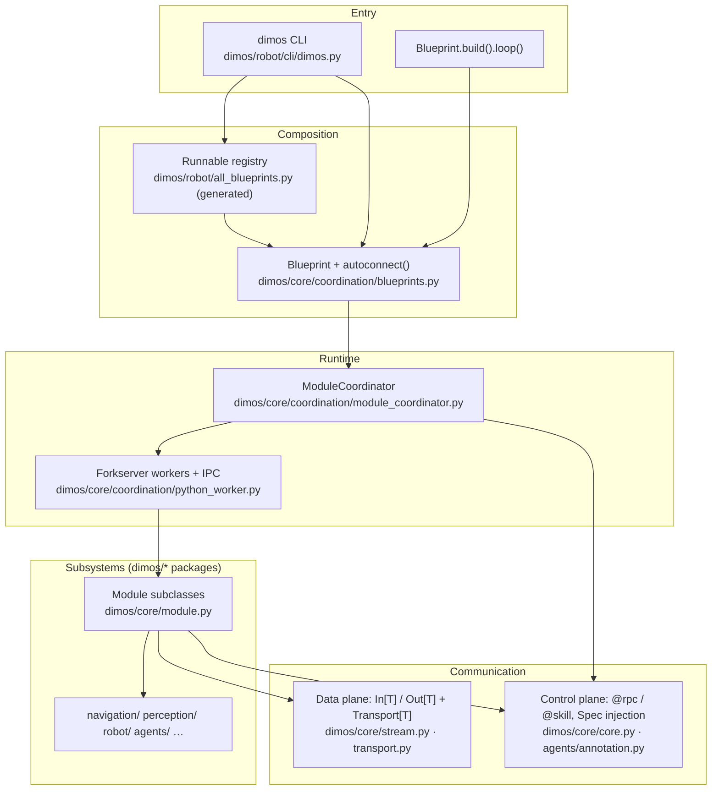

# DimOS architecture (overview)

This page is a **short, repo-neutral tour** of how DimOS is structured end-to-end: what runs at runtime, how modules talk, how stacks are composed, and where agents and tools fit. It complements the AI-oriented workflow guide [AGENTS.md](../AGENTS.md) and points to deeper docs instead of restating them.

For capability-focused write-ups (navigation, manipulation, agents, and similar), browse for example [capabilities — agents](capabilities/agents/readme.md), [capabilities — navigation](capabilities/navigation/readme.md), and platform guides such as [Unitree Go2](platforms/quadruped/go2/index.md) and [Unitree G1](platforms/humanoid/g1/index.md).

## Goals

- **Compose** independent robot subsystems as typed **modules** wired by **blueprints**.
- **Stream** sensor-heavy and high-rate data over pluggable **transports** (LCM, shared memory, ROS 2, DDS, and others).
- **Orchestrate** lifecycle and process isolation via **workers** and the **module coordinator**.
- **Expose** agent-callable **skills** (JSON-schema tools) to LLMs and external clients via **RPC**, **MCP**, and the **CLI**.

## Layered mental model

## Terminology (quick map)

| Term | Meaning | Pointers |
|------|---------|----------|
| **Module** | Autonomous subsystem: declares typed `In`/`Out` streams and optional RPC methods. | [Modules](usage/modules.md) |
| **`In[T]` / `Out[T]`** | Subscriber and publisher endpoints for messages of type `T`. | [Streams hub](usage/sensor_streams/README.md), [modules.md](usage/modules.md) |
| **Transport** | Backend that carries a stream (LCM, SHM, ROS, DDS, …). | [Transports](usage/transports/index.md) |
| **Blueprint** | Recipe to construct and wire one or more modules; `autoconnect()` merges many into one graph. | [Blueprints](usage/blueprints.md) |
| **`@rpc`** | Callable across process boundaries; used for commands and lifecycle. | [Blueprints — RPC](usage/blueprints.md#calling-the-methods-of-other-modules) |
| **`@skill`** | RPC surface also exposed to LLMs / MCP as a tool (requires docstring + simple types). | [Skills](usage/blueprints.md#defining-skills), [Agent docs index](agents/index.md) |
| **Spec** | Typed protocol for dependency injection between modules at blueprint build time. | [Blueprints](usage/blueprints.md) |
| **GlobalConfig** | Central flags and env-backed settings (robot IP, replay, MCP port, …). | [Configuration](usage/configuration.md) |

## Data plane vs control plane

**Data plane** — high-volume or continuous messages (images, point clouds, odometry, etc.). Modules publish and subscribe through `Out[T]` and `In[T]`; each connection selects a `Transport` implementation. This keeps sensor pipelines decoupled from RPC timing. See [Transports](usage/transports/index.md) and [Data streams](usage/data_streams/README.md).

**Control plane** — infrequent, request/response or imperative actions: start/stop, set goals, trigger skills. Implemented with `@rpc` (and `@skill` for agent-visible tools), serialized across workers, and resolved via the coordinator. Typed cross-module calls can use **Spec** so wiring fails at build time if a dependency is missing. See [Blueprints — RPC and skills](usage/blueprints.md).

## Deployment and runtime

When you `dimos run <name>` or call `blueprint.build().loop()`, the **module coordinator** expands the blueprint graph, assigns modules to **forkserver-backed worker processes**, and connects streams plus RPC routes. Heavy or isolated work stays in workers; the main process drives lifecycle and CLI integration. Implementation detail lives under `dimos/core/coordination/` (for example `module_coordinator.py`, `python_worker.py`, and worker manager modules).

## Composition and the blueprint registry

Application stacks are **Python blueprint values** built with `autoconnect(...)`, optionally remapped or given explicit transports when auto-matching is insufficient. Runnable blueprints registered for the CLI are listed in **`dimos/robot/all_blueprints.py`**, which is **auto-generated** — add or rename a blueprint in code, then regenerate with `pytest dimos/robot/test_all_blueprints_generation.py` as described in [AGENTS.md](../AGENTS.md) and [dimos_run.md](development/dimos_run.md).

## Agents, MCP, and the CLI

**Agents** are modules that reason over streams and issue tool calls. **`@skill`** methods on skill containers become tools with JSON schema for the model. When a blueprint includes **McpServer** and **McpClient**, skills are also reachable over HTTP MCP for external clients; the default listen port comes from **GlobalConfig** (`mcp_port`). The same stack is driven from the terminal via `dimos run`, `dimos agent-send`, and `dimos mcp …`. Entry points and flags are summarized in [CLI](usage/cli.md) and [dimos_run.md](development/dimos_run.md). Agent-focused documentation: [Agent docs index](agents/index.md) and [Agentive control / MCP capability](capabilities/agents/readme.md).

## Configuration

**GlobalConfig** merges defaults, `.env`, environment variables (`DIMOS_*`), blueprint fields, and CLI flags into a single resolved settings object used by transports, logging paths, MCP, simulation/replay modes, and more. See [Configuration](usage/configuration.md).

## Package layout (under `dimos/`)

High-signal directories (not exhaustive):

| Path | Role |
|------|------|
| `core/` | Module base class, streams, transports, coordination, global config, run registry. |
| `robot/` | CLI entry, blueprint registry, vendor stacks (Unitree, xArm, drone, …). |
| `agents/` | Agent implementation, `@skill`, MCP client/server adapters, shared skills. |
| `navigation/` · `perception/` · `visualization/` | Planning, perception pipelines, Rerun bridge. |
| `msgs/` | Shared message types (geometry, sensor, nav, …). |
| `utils/` | Logging, helpers, tooling. |

Robot-specific tuning and tutorials usually live under [docs/platforms](platforms/quadruped/go2/index.md) and [docs/capabilities](capabilities/agents/readme.md) so this overview stays stable as hardware support grows.

## Further reading

- [Agent docs](agents/index.md) — agent system documentation hub.
- [Modules](usage/modules.md) — tutorial depth, I/O printing, lifecycle.
- [Blueprints](usage/blueprints.md) — `autoconnect`, RPC, skills, remapping.
- [Sensor streams](usage/sensor_streams/README.md) — pub/sub concepts.
- [Transports](usage/transports/index.md) — choosing LCM vs SHM vs ROS/DDS.
- [Configuration](usage/configuration.md) — `GlobalConfig` and module configs.
- [Visualization](usage/visualization.md) — Rerun and graph views.
- [CLI](usage/cli.md) and [dimos_run.md](development/dimos_run.md) — running and adding blueprints.
- [Testing](development/testing.md) — fast vs slow pytest sets.
- [Writing docs](development/writing_docs.md) — diagrams and doc conventions.
