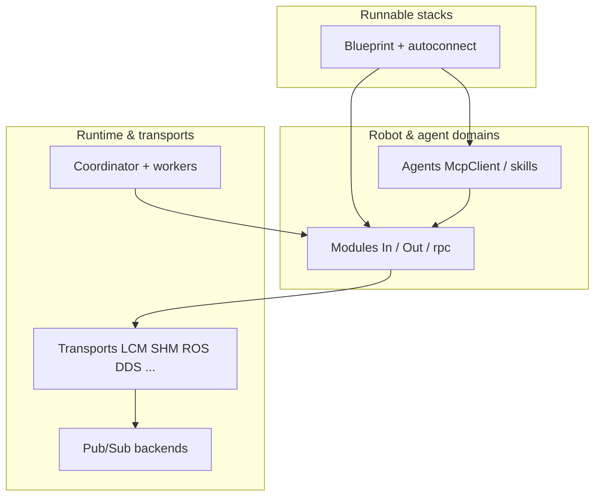
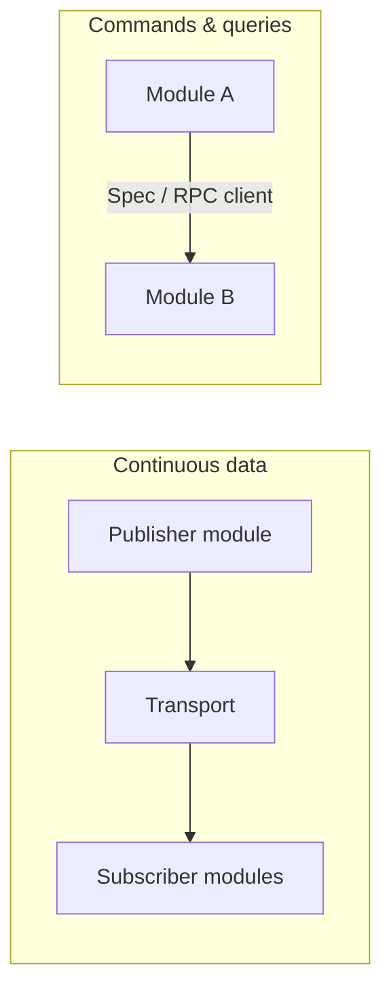
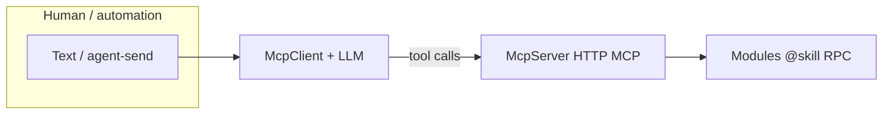

# DimOS Architecture

This page is a **single entry point** into how DimOS is structured at runtime and in the repository. Deep dives live elsewhere; use the links inline and in [Recommended reading order](#recommended-reading-order) when you need detail.

Contributor-oriented workflow notes (skills, MCP CLI, blueprint registry regeneration) remain in **[`AGENTS.md`](../../AGENTS.md)**.

---

## What DimOS Optimizes For

DimOS targets **composed robot stacks** where many subsystems run concurrently, exchange **typed streams** of sensor and control data, and optionally expose **RPC** and **LLM-facing skills**. A **blueprint** describes which modules belong in a runnable stack and how their streams attach; **`GlobalConfig`** and per-module **`ModuleConfig`** carry deployment settings.

---

## Layered Model

The stack is deliberately layered so you can swap how data moves without rewriting module logic:

- **Blueprint** — Declarative composition: which module classes participate, stream wiring, overrides. See [`blueprints.md`](blueprints.md).
- **Module** — Autonomous units with **`In[T]` / `Out[T]`** streams and **`@rpc` / `@skill`** methods. See [`modules.md`](modules.md) and the [sensor streams overview](sensor_streams/README.md).
- **Transport** — How a named stream crosses process or machine boundaries (LCM multicast, shared memory, ROS 2 bridge, DDS when enabled, etc.). Modules publish/subscribe against a uniform API. See [`transports/index.md`](transports/index.md).

The transports doc already summarizes the same layering with an additional **Pub/Sub** step; refer there for benchmarks and semantics (best-effort vs reliable).

---

## Runtime: From `build()` to a Running Stack

At a high level:

1. **`autoconnect(...)`** merges module blueprints and derives stream edges from matching `(stream name, message type)` pairs.
2. **`Blueprint.build()`** deploys modules into **worker processes** (forkserver-based pool; see `dimos/core/coordination/`) and wires **transports** and **RPC** stubs.
3. **`loop()`** on the main side keeps the coordinator alive until shutdown (`dimos run` invokes the same path — see [`cli.md`](cli.md)).

Data and control therefore split into two familiar paths:

- **Streams** carry high-rate or continuous messages (images, odometry, maps).
- **RPC** is for discrete calls (start/stop, set goal, skill execution). Cross-module typing uses **`Spec`** protocols resolved at blueprint build time (`dimos/spec/`).

---

## Repository Layout (Where to Look)

| Area | Role | Pointers |
|------|------|----------|
| **`dimos/core/`** | Module base class, streams, blueprints, coordination, transports, global config | `module.py`, `coordination/blueprints.py`, `global_config.py` |
| **`dimos/robot/`** | Robot-specific connection, sim, and runnable **blueprint** entry points | e.g. `dimos/robot/unitree/go2/`, registry in `all_blueprints.py` |
| **`dimos/agents/`** | Agent module, prompts, MCP client/server, shared skills | `agents/mcp/`, `annotation.py` (`@skill`) |
| **`docs/capabilities/`** | Capability-oriented overviews (navigation, perception, agents, manipulation) | e.g. [`agents/readme.md`](../capabilities/agents/readme.md) |

**Blueprint registry:** `dimos/robot/all_blueprints.py` is **generated**. After adding or renaming a top-level blueprint module, regenerate with the test described in [`AGENTS.md`](../../AGENTS.md) (`pytest dimos/robot/test_all_blueprints_generation.py`).

---

## Agents, MCP, and Skills

Agentic stacks add modules that consume streams and emit **skill** tool calls:

- **`McpServer`** exposes `@skill` methods over HTTP MCP (listening on **`GlobalConfig.mcp_port`**, default in `dimos/core/global_config.py`; override via **`MCP_PORT`** env, **`.env`**, or CLI **`--mcp-port`** — see [`configuration.md`](configuration.md) and [`cli.md`](cli.md)).
- **`McpClient`** connects the LLM agent to those tools.

Conceptual overview and diagrams for the agent path: [Agents capability overview](../capabilities/agents/readme.md).

---

## Relation to ROS 2

DimOS **does not require** ROS for its core messaging; **LCM** and other backends are first-class.

When you **do** integrate with ROS 2, **`ROSTransport`** bridges stream types to ROS topics (`dimos/core/transport.py`, covered in [`transports/index.md`](transports/index.md)). Think of ROS as **one backend** for streams and interoperability, not the sole composition model — stacks are still defined as DimOS modules and blueprints.

---

## Glossary

| Term | Meaning |
|------|---------|
| **Module** | `Module` subclass: owns streams (`In`/`Out`), lifecycle RPC, optional `@skill` methods (`dimos/core/module.py`). |
| **Stream** | Typed publish/subscribe channel declared on a module; implemented via transports across processes (`dimos/core/stream.py`). |
| **Blueprint** | Immutable composition of module factories plus wiring metadata; **`autoconnect`** expands and connects compatible streams (`dimos/core/coordination/blueprints.py`). |
| **Skill** | `@skill`-decorated RPC intended for LLM tool use; schema from docstrings and type hints (`dimos/agents/annotation.py`). |
| **Spec** | `typing.Protocol`-style boundary for injecting another module’s RPC surface without stringly coupling (`dimos/spec/utils.py`). |
| **GlobalConfig** | Process-wide deployment settings (`dimos/core/global_config.py`); cascades from defaults, `.env`, environment variables (e.g. **`MCP_PORT`** for `mcp_port`), blueprint, CLI. |

---

## Recommended reading order

1. This page — orientation.
2. [`modules.md`](modules.md) — how to write modules and streams; [`sensor_streams/README.md`](sensor_streams/README.md) — stream names, types, and graph view.
3. [`blueprints.md`](blueprints.md) — **`autoconnect`**, RPC between modules, skills.
4. [`transports/index.md`](transports/index.md) — choosing and configuring transports.
5. [`configuration.md`](configuration.md) — **`Configurable`**, **`GlobalConfig`**, CLI flags.
6. [`cli.md`](cli.md) — **`dimos run`** / **`build().loop()`** lifecycle and registry-backed commands.
7. Capability docs under [`docs/capabilities/`](../capabilities/) — domain-specific narratives.
8. [`AGENTS.md`](../../AGENTS.md) — contributor workflow, testing, MCP CLI, codegen notes.
